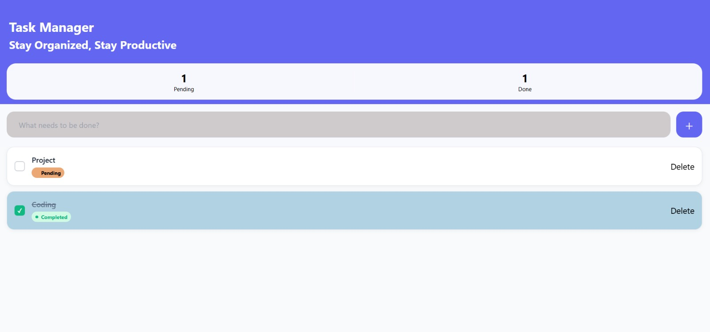
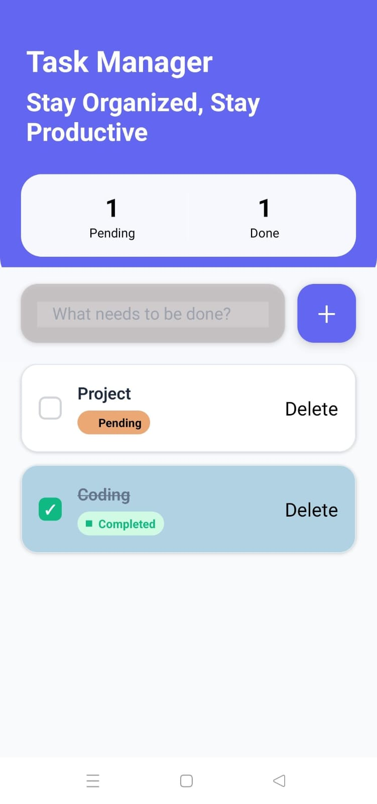

## TO-DO-APP(Task Manager)

A high-performance, cross-platform task management application built using React Native and Expo.
Designed with a strong focus on productivity, clean UI/UX, and performance, this app runs seamlessly across Mobile and Web with persistent local storage.

## Features

Dynamic Dashboard
Real-time tracking of Pending and Completed tasks via a dedicated statistics header.

Intuitive Task Management
Effortlessly add, update, and delete tasks with instant UI feedback.

Platform-Optimized Input
Custom-styled input fields that remove default browser focus outlines on Web, ensuring a native look and feel.

Smart Visual Logic

Strikethrough typography for completed tasks

Color desaturation for inactive tasks

Clear status badges for quick recognition

Data Persistence
Integrated AsyncStorage ensures tasks remain saved across app reloads and browser refreshes.

Safe Deletion
Confirmation logic prevents accidental task removal, enhancing data safety.

## 📸 Screenshots

📌 Add screenshots after pushing images to the repository (recommended: /assets/screenshots/)

## Web Interface

## Mobile View

## ⚡Tech Stack

Framework: React Native (Expo)

Language: JavaScript (ES6+)

State Management: React Hooks (useState, useEffect)

Storage: AsyncStorage (Local Storage)

Styling: React Native StyleSheet with platform-specific optimizations

## Project Architecture

A modular and scalable folder structure ensures clean code and maintainability.

TO-DO-APP/
├── components/
│   ├── AddTask.js      # Task input logic & submission handling
│   └── TaskItem.js     # Responsive task card & user interactions
├── theme/
│   └── Colors.js       # Centralized color system & branding
├── App.js              # Core application logic & state controller
├── app.json            # Expo configuration
├── package.json        # Dependencies & scripts
└── README.md           # Project documentation

## Installation & Setup
Prerequisites

Node.js v18+

npm or yarn

Expo CLI (optional)

## 1️⃣ Clone & Install
git clone <your-repository-link>
cd TO-DO-APP
npm install

## 2️⃣ Start Development Server
npx expo start

## 3️⃣ Run the App

Web: Press w in the terminal

Mobile: Scan the QR code using Expo Go (Android) or Camera App (iOS)

## Developer

## Parth Jagad
Frontend Developer | React | React Native | UI/UX Focused